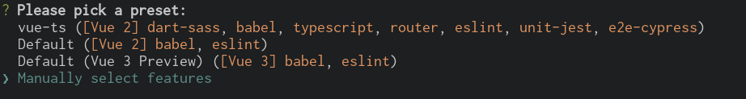
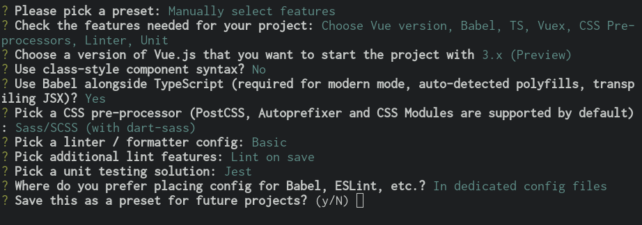

Tutorial
========

In this tutorial we will see how to create, step by step, a server side Flask
application communicating with a Vue3/Inertia frontend using Typescript.

App skeleton
------------

First let's create the app skeleton:

.. code:: bash

  .
  |-- Makefile
  |-- README.md
  |-- app.py
  |-- static
  |   |-- dist
  |   `-- vue
  |-- templates
  |   `-- base.html

The ``app.py`` file is a simple single file Flask application using as arguments
the ``templates`` directory as ``template_folder`` and ``static/dist`` as
``static_folder``.

The ``static/vue`` store the frontend application powered by Vue3/Inertia. Vue
generates two JavaScript files on build named ``app.js`` and ``chunk-vendors.js``
containing respectively our app and third-party modules. It will be configured to
generate these files in our ``static/dist`` folder to be available for our Flask
application.

Since, there are going to be two different applications (Python and Vue), a
``Makefile`` will be used to run the parallel build and provide a ``hot-reload``
development environment.

Server-side setup
-----------------

Install dependencies
++++++++++++++++++++

Install the Inertia server-side framework and adapters using ``pip``:

.. code:: bash

   pip install -U flask flask-inertia

The Flask application
+++++++++++++++++++++

Create a Flask application using the Inertia adapter in our ``app.py`` file::

  #!/usr/bin/env python3

  from flask import Flask
  from flask_inertia import Inertia

  # `base.html` template will be used as inertia default template
  INERTIA_TEMPLATE = "base.html"

  # init the app setting `template_folder` and `static_folder`
  app = Flask(
      __name__,
      template_folder="templates",
      static_folder="static/dist",
  )

  # set the config
  app.config.from_object(__name__)

  # init inertia adapter
  Inertia(app)

The root template
+++++++++++++++++

Setup the root template used by Inertia adapter that will be loaded on the first
page visit, it will contain the routes to the files generated by the Vue
application:

.. code:: jinja

  <!DOCTYPE html>
  <html>
    <head>
      <meta charset="utf-8" />
      <meta name="viewport" content="width=device-width, initial-scale=1.0, maximum-scale=1.0" />
      <title>My app</title>
      <link href="{{ url_for('static', filename='css/app.css') }}" rel="stylesheet" />
      
    </head>
    <body>
      

      
      
    </body>
  </html>

The ``inertia.include_router`` expose the Flask routes to the client side
implementing a ``window.reverseUrl`` method.

Client-side setup
-----------------

Build a Vue app using Typescript with the ``@vue/cli`` tool.

Install dependencies
++++++++++++++++++++

.. code:: bash

   cd static/vue
   npm install -G @vue/cli
   vue create .

Choose the Vue version and the Typescript support.

Install the Inertia dependendencies:

.. code:: bash

   npm install @inertiajs/inertia @inertiajs/inertia-vue3 @babel/plugin-syntax-dynamic-import

Reconfigure the app deleting all the auto generated files we won't need and
creating missing folders:

.. code:: bash

   rm -rfv src/App.vue src/components/ src/assets/logo.png public/
   mkdir src/pages/

Vue configuration
+++++++++++++++++

There are modification to the Vue configuration to make it usable with our
application:

By default, Vue embed a ``Webpack-dev-server`` to serve the app. It will be
disabled in the ``package.json`` file replacing it with a ``build`` development
mode. This task will allow you to configure a ``hot-reload`` development
environment generating the ``app.js`` and ``chunk-vendors.js`` files. These files
will be served by the Flask app.

.. code:: JSON

   {
     "scripts": {
       "build:dev": "vue-cli-service build --mode development --watch",
       "build:prod": "vue-cli-service build",
       "test": "vue-cli-service test:unit",
       "lint": "vue-cli-service lint"
     }
   }

Vue needs to be configured to generate the JavaScript code into the ``static/dist``
configured in the server-side application. Based on the application architecture,
there will be no need to generate a html file with Vue since our ``base.html``
will be rendered by Flask. Those configuration are stored in a ``vue.config.js``
file in the ``static/vue`` folder.

.. code:: javascript

   module.exports = {
     publicPath: '/dist/',
     outputDir: '../dist/',
     // disable hashes in filenames
     filenameHashing: false,
     // delete HTML related webpack plugins
     chainWebpack: config => {
       config.plugins.delete('html')
       config.plugins.delete('preload')
       config.plugins.delete('prefetch')
     }
   }

Integrate Inertia
+++++++++++++++++

The application will use code-splitting, allowing to break it apart into smaller
files. To use it with Inertia, create a ``babel.config.js`` file in ``static/vue``
folder containing:

.. code:: javascript

   module.exports = {
     presets: [
       '@vue/cli-plugin-babel/preset'
     ]
   }

Next, modify the ``static/vue/src/main.ts`` file as followed:

.. code:: typescript

    import { createApp, h } from 'vue'
    import { createInertiaApp } from '@inertiajs/inertia-vue3'

    type StrOrNum = string | number

    // type window.reverseUrl method
    declare global {
      interface Window {
        reverseUrl(urlName: string, args?: Record<string, unknown> | StrOrNum | StrOrNum[]): string
      }
    }

    createInertiaApp({
      resolve: async name => {
        const page = await import(`./pages/${name}`)
        return page.default
      },
      setup({ el, app, props, plugin }) {
        const vueApp = createApp({ render: () => h(app, props) })
        // use plugin and store if enabled
        vueApp.use(plugin)
        // set global method to use window.reverseUrl
        vueApp.config.globalProperties.$route = window.reverseUrl
        // mount
        vueApp.mount(el)
      }
    })

Create your views
-----------------

With Inertia, each page in your application has its own controller and corresponding
Vue component. This allows you to retrieve just the data necessary for that page,
no API required.

First view
++++++++++

Update your ``app.py`` file to add a new route using the module ``render_inertia``
method::

   from flask_inertia import render_inertia

   # init app as described above

   @app.route("/")
   def index():
       """Example route."""
       fake_data = {
           "foo": "bar",
           "fiz": "buzz",
           "num": 42,
       }
       return render_inertia("Index", props=fake_data)

This route will use a ``Index.vue`` page stored in ``static/vue/src/pages``. It
can be implemented as followed:

.. code-block:: vue

   <template>
     

       

         Foo :
         {{ foo }}
       

       

         Fiz :
         {{ fiz }}
       

       

         Num :
         {{ num }}
       

     

   </template>

   

   

For more options creating your views, please read the provided
`Inertia documetation <https://inertiajs.com/pages>`_.

Add links between your routes
+++++++++++++++++++++++++++++

Create a second dummy route to see how to create links between our components.
Update your ``app.py`` file adding a second route::

   @app.route("/parameters/")
   def params():
       """Second route."""
       return render_inertia("Params")

Then, create a corresponding Vue component named ``Params.vue`` in the ``pages``
folder:

.. code-block:: vue

   <template>
     <strong>It works</strong>
   </template>

   

Flask-inertia provides a ``window.reverseUrl`` client side to allow Vue to access
Flask defined routes. The line

.. code:: typescript

   app.config.globalProperties.$route = (window as any).reverseUrl

in the ``main.ts`` file make it usable in all the application components registering a
``$route`` method as a global property.

To create Inertia requests, ``inertia-vue3`` implements a new Vue component named
``inertia-link`` (or ``InertiaLink``). It can be used in the ``Index`` page as
followed:

.. code-block:: vue

  <template>
    

      

        Foo :
        {{ foo }}
      

       

         Fiz :
         {{ fiz }}
       

       

         Num :
         {{ num }}
       

       <InertiaLink :href="$route('params')">
         My params
       </InertiaLink>
    

  </template>

Automate development environment
--------------------------------

To run the application in development mode two processes needs to executed:

* A Flask process running the app in development mode
* A Vue build process watching for any changes in the code source files

For more convenience, a Makefile will be used to run these processes in parallel
with a single command. Implement the Makefile present in your project root folder
as followed:

.. code:: Makefile

   # use parallel tasks
   MAKEFLAGS+="-j 2"

   .PHONY: all
   all: dev

   # run Flask app in development mode
   dev-python:
          FLASK_APP=app:app FLASK_ENV=development flask run

   # build Vue app in development mode with hot-reload
   dev-vue:
          @npm run --prefix static/vue/ build:dev

   # run development environment
   dev: dev-python dev-vue

Then, run ``make dev`` to run your development environment.
